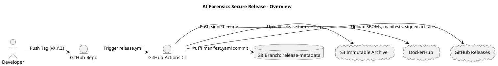
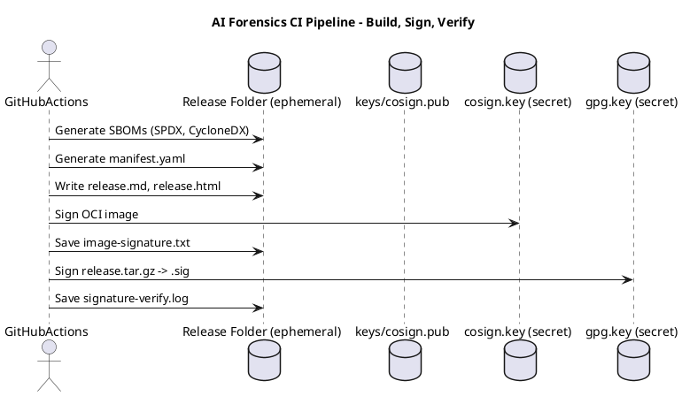
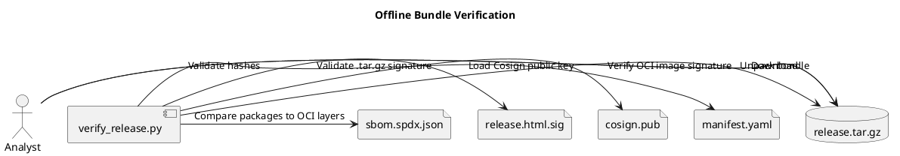
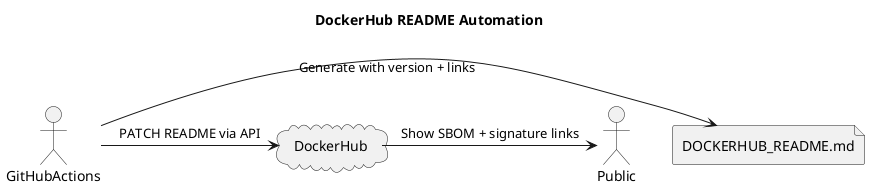
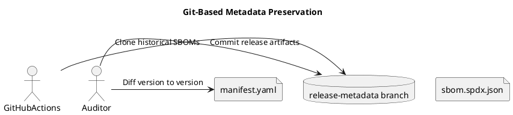

# 🔐 Software Supply Chain Overview – AI Forensics

This document outlines how **AI Forensics** implements secure software supply chain practices for verifiable, tamper-evident, and cryptographically traceable releases.

---

## 📦 Artifacts

Each release includes:

| Artifact | Description |
|----------|-------------|
| `release.md`, `release.html` | Human-readable changelogs |
| `sbom.cyclonedx.json`, `sbom.spdx.json` | Software Bill of Materials |
| `manifest.yaml` | Canonical SHA256 hashes of all release components |
| `image-signature.txt`, `signature-verify.log` | Cosign signature and verification results |
| `release.tar.gz`, `.sig` | Signed bundle of all the above |
| `cosign.pub` | Public key for image and metadata verification |
| `cosign.key` | Stored securely, not published |
| `release-metadata` branch | Snapshot of all release artifacts under Git control |
| `DockerHub README` | Links to signatures and verification instructions |

---

## 🔐 Signing Tools & Policies

### 🔏 Cosign

- Used to sign container images at release time
- Signature stored in OCI registry (GHCR, DockerHub)
- Verification enforced via `verify_release.py` and `cosign verify`
- Public key published in: [`keys/cosign.pub`](../keys/cosign.pub)

### 🔏 GPG

- Used to sign `release.tar.gz` bundles
- Public key (`cosign.pub.gpg`) must be imported by users
- Detached `.sig` used for verification

---

## 📃 SBOM Strategy

- SBOMs are generated in both **SPDX** and **CycloneDX** formats
- Embedded in the release bundle
- Mapped to container layers using `docker inspect` at release time

---

## 🔁 GitHub + DockerHub Sync

- Every release:
  - Is built, signed, and published to GHCR and DockerHub
  - Has a complete release bundle uploaded to S3
  - Has a tag-pinned `release-metadata` branch commit
  - Updates the DockerHub README with verification and download links

---

## ✅ Verification Script

Run this command in an offline setting to verify full integrity:

```bash
poetry run verify-release ./release
```

This includes:
- GPG signature check of .tar.gz
- Hash validation via manifest.yaml
- Cosign verification of OCI image
- Optional SBOM-to-layer comparison

---

## ✅ 2. GitHub Action to Sync DockerHub README


---

## ✅ 2. GitHub Action to Sync DockerHub README

DockerHub doesn’t support direct README editing from GitHub, but you can sync it using the DockerHub API.

### 🔐 Required Secrets

| Name | Description |
|------|-------------|
| `DOCKERHUB_USERNAME` | Your DockerHub account |
| `DOCKERHUB_PASSWORD` | DockerHub Personal Access Token |
| `DOCKERHUB_REPO`     | `yourusername/ai-forensics` |

---

### 📝 Add File: `.github/actions/update-dockerhub-readme/action.yml`

```yaml
name: Update DockerHub README
description: Syncs local README.md to DockerHub via API

inputs:
  readme:
    required: true
  description:
    required: false
    default: "AI Forensics - Secure model scanner"
  repo:
    required: true

runs:
  using: "composite"
  steps:
    - name: Update DockerHub README
      shell: bash
      run: |
        README_CONTENT=$(<${{ inputs.readme }})

        curl -s -X PATCH \
          -u "${{ secrets.DOCKERHUB_USERNAME }}:${{ secrets.DOCKERHUB_PASSWORD }}" \
          https://hub.docker.com/v2/repositories/${{ inputs.repo }}/ \
          -H "Content-Type: application/json" \
          -d "$(jq -n \
              --arg full_description "$README_CONTENT" \
              --arg description "${{ inputs.description }}" \
              '{full_description: $full_description, description: $description}')"
```
🧪 Use It in `release.yml` or `publish-release.yml`
```yaml
- name: Update DockerHub README
  uses: ./.github/actions/update-dockerhub-readme
  with:
    readme: docs/DOCKERHUB_README.md
    repo: ${{ secrets.DOCKERHUB_REPO }}
```
>🔧 Create docs/DOCKERHUB_README.md during release, containing latest version + links to .tar.gz, Cosign verify instructions, etc.

Updates to the pipelines:

✅ 1. Auto-Generated DOCKERHUB_README.md During Release
🔧 Add to release.yml (after tag and before uploading artifacts):

```yaml
- name: Generate DockerHub README
  run: |
    TAG=${GITHUB_REF##*/}
    cat > docs/DOCKERHUB_README.md <<EOF
# AI Forensics

Secure, auditable AI model and container scanner for forensic use in disconnected or classified environments.

---

## 🔖 Latest Version: \`$TAG\`

**Container Image**

\`\`\`bash
docker pull yourdockerhubuser/ai-forensics:$TAG
cosign verify --key https://yourdomain.tld/cosign.pub yourdockerhubuser/ai-forensics:$TAG
\`\`\`

---

## 📦 Release Artifacts

- 🔗 [release.tar.gz](https://yourdomain.tld/releases/$TAG/release.tar.gz)
- 🔏 [release.tar.gz.sig](https://yourdomain.tld/releases/$TAG/release.tar.gz.sig)
- 📄 [manifest.yaml](https://yourdomain.tld/releases/$TAG/manifest.yaml)

---

## ✅ Offline Verification

\`\`\`bash
gpg --verify release.tar.gz.sig release.tar.gz
tar -xzf release.tar.gz
python3 verify_release.py release/
\`\`\`

---

## 🧾 SBOM Files

- [sbom.spdx.json](https://yourdomain.tld/releases/$TAG/sbom.spdx.json)
- [sbom.cyclonedx.json](https://yourdomain.tld/releases/$TAG/sbom.cyclonedx.json)

EOF
```
>You can add this file to `release-bundle` and use it for the DockerHub README sync in `publish-release.yml`.

📘 Diagram 1: High-Level Release Overview



📘 Diagram 2: CI Signing & Verification Flow



📘 Diagram 3: Post-Release Verification Workflow



📘 Diagram 4: DockerHub README + Bundle Link Sync



📘 Diagram 5: Git Metadata Traceability


